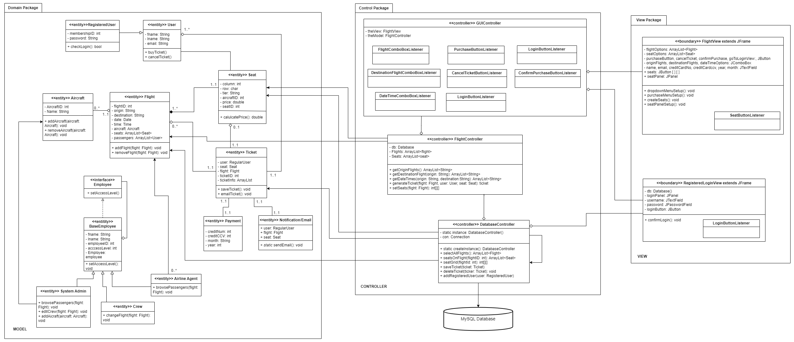
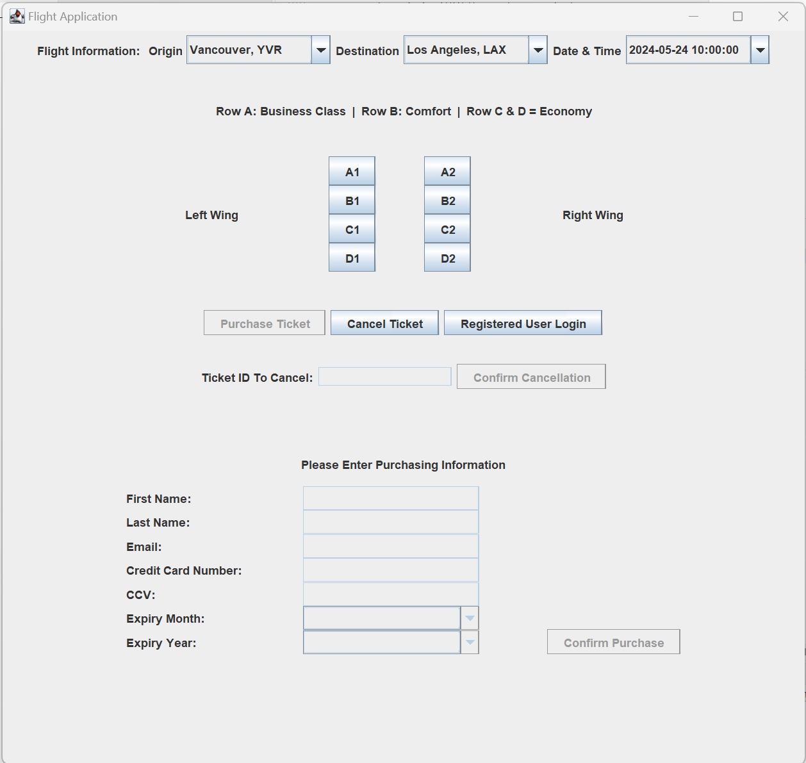

# Flight Application 

Flight application using a Java GUI with functionality to:
- browse availalbe flights to a specific  
- select deisred flight
- browse seat map
- select deisred seat
- make payment
- recieve ticket via email 
- cancel flight 

**Design Phase**

The design document contains use case diagrams, activity diagram, sequence diagram, state diagrams and domain diagrams for the application. 

**Implementation**

Client-Server Architecture: The system uses a graphical user interface, GUI, developed using Java Swing that handles user interactions including login, browsing and selecting flights, select seats, purchasing a ticket and cancelling a ticket. 

Database Connectivity: A MySQL database stores information such as flight details, aircraft details, user profiles for registered users and bookings or tickets.   

Key Design Patterns:
Model-View-Controller: The system follows this architectural pattern. 
Singleton: The database connection is implemented in this pattern. 
Decorator: The different types of employees follow this pattern. They were not implemented but are shown in the design.   

**Diagrams & Screenshots**

